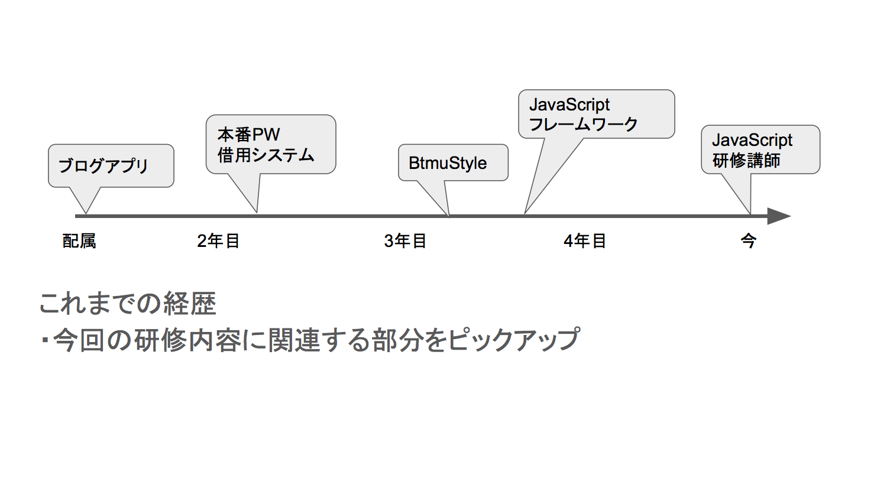

# Slide Viewer

## サンプルの起動手順

1. git clone https://github.com/ozaki25/slide_viewer.git
1. cd slide_viewer
1. npm install
1. gulp server
1. http://127.0.0.1:8000/ にアクセス

## 使い方

* 以下の形式でhtmlを作成するとSlide Viewerが適用される

````html
<div class="slide-images">
  
  
  
</div>
````
